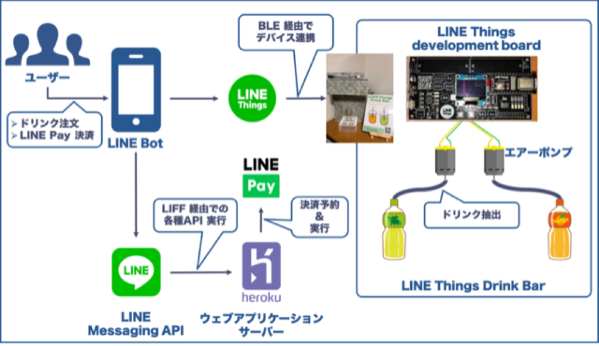

# 第11章 LINE Pay 決済とLINE Things に対応したドリンクバーを開発する
著者：加川 澄廣（[@sumihiro3](https://twitter.com/sumihiro3/)）  

## LINE Things Drink Bar とは

「LINE Things Drink Bar」は、LINE Pay での決済機能と、LINE アプリからハードウェアを操作できるIoT プラットフォームであるLINE Things に対応したジュースの自動販売機のプロトタイプです。いわゆるカップ式自動販売機です。
商品（ジュース）の選択から支払い（LINE Pay での決済）、ハードウェアへのジュース抽出の指示、購入後の抽選に至るすべてをLINE アプリ一つで操作できます。

### システム構成図

LINE Messaging API やLINE Pay API との連携は、クラウド・アプリケーション・プラットフォームであるHeroku 上に構築したサーバを介して行います。

Web アプリケーションのフロントサイドはVue.js 、サーバサイドはWeb アプリケーション フレームワークのFlask で実装します。
商品情報の取得や注文情報の登録はサーバサイドで提供するAPI を、フロントサイドから実行するという構成になっています。

## プロトタイプのソースコード

### /app

サーバーサイドのプログラムです。
Python のウェブアプリケーション・フレームワークFlask を利用しています。

### /db

データベースに作成するテーブル、初期データ登録用のSQL です。

### /things

ハードウェア側のソースコードです。
Arduino IDE を利用してLINE Things development board に書き込みます。

### /Dockerfile

サーバーサイドプログラム用のDockerfile です。
Python や必要なモジュールをインストールし、Flask アプリを起動します。

### /requirements.txt

サーバーサイドプログラムで必要なモジュールを定義しています。
